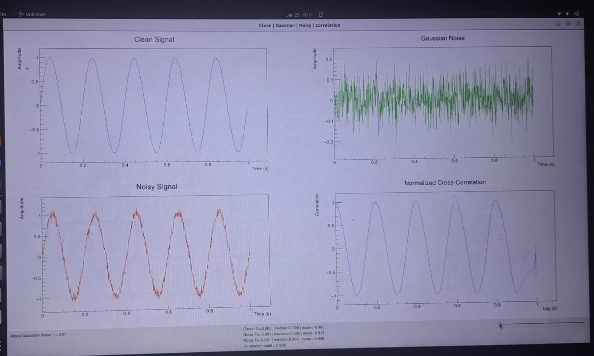
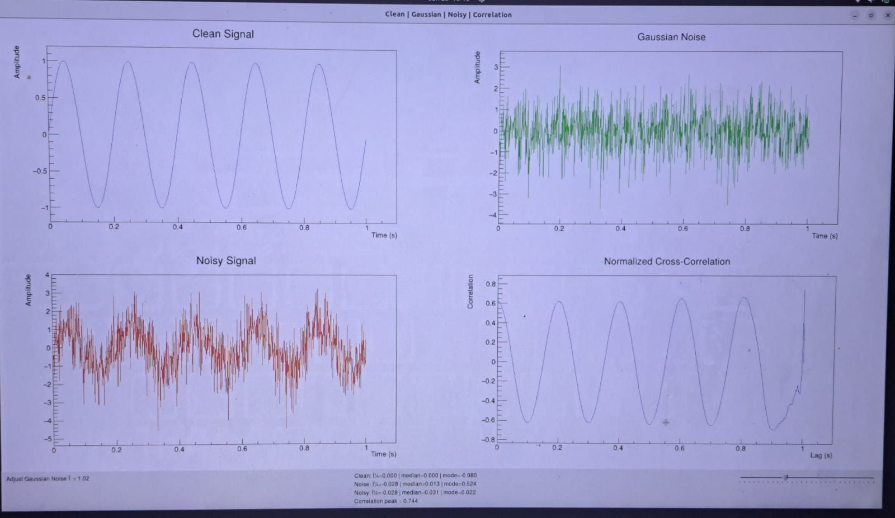

# WaveformAnalytics
WaveformAnalytics is an interactive ROOT/C++ tool for real-time visualization and analysis of signals, Gaussian noise, and noisy waveforms. It computes cross-correlation and statistical measures, enabling users to study noise effects on signal integrity dynamically.

# Features

Interactive Noise Control: Adjust Gaussian noise in real time using a slider.

Multiple Signal Visualizations: Separate plots for clean signal, Gaussian noise, noisy signal, and normalized cross-correlation.

Statistical Analysis: Computes mean, median, mode, and correlation peak for all signals.

Cross-Correlation: Quantifies similarity between clean and noisy signals.

High-Performance Implementation: Built in ROOT/C++ for efficient, responsive simulations.

# Installation

Install ROOT
 (v6 or later recommended).

Clone this repository:

git clone https://github.com/<manahilfaisal>/WaveformAnalytics.git

Open ROOT and load the macro:

root -l
.L WaveformAnalytics.C+
WaveformAnalytics();

# Usage

Move the slider to adjust the Gaussian noise standard deviation (σ).

Observe updates in:
Gaussian noise
Noisy signal (clean + noise)
Normalized cross-correlation
View live statistics of all signals in the GUI.

# Results 

